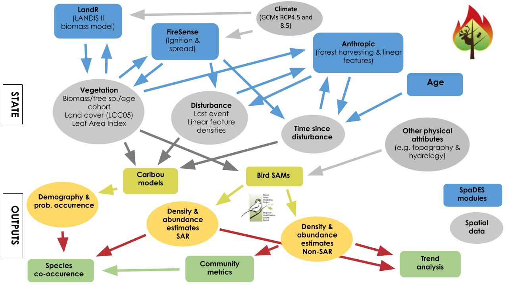

^[\textsuperscript University of British Columbia, \textsuperscript 2 Natural Resources Canada, Canadian
  Forest Service, \textsuperscript 3WavX Inc , \textsuperscript 4 University of Alberta, \textsuperscript 5Universite Laval, \textsuperscript 6fRI]

# Executive Summary

The purpose of this project was to support multi-species modelling objectives of Environment and Climate Change Canada (ECCC) 
with respect to
woodland caribou and migratory songbirds. We sought to integrate models of vegetation dynamics, wildfire, and anthropogenic change with
statistical models of songbird abundances and woodland boreal caribou (*Rangifer tarandus caribou*) resource selection and demographic
parameters. The integration framework is SpaDES (Chubaty and McIntire 2017), a system of R packages for statistical and geospatial
analysis and spatial simulation, designed for ecological forecasting applications, especially powerful over very large areas. 
The integrated model is used to forecast the spatial distribution of selected songbird species 
and the regional potential to sustain viable populations of woodland
boreal caribou, under climate change over the 21st century. Other potential applications include quantifying the overlap between areas
of high conservation value for birds and for caribou, and evaluating the conservation potential in these respects of specific candidate
protected areas.  The spatial extent of this work is Bird Conservation Region (BCR) 6 as contained within the Northwest Territories of
Canada. The integrated model is implemented as a suite of eight groups of  SpaDES modules. A common spatial resolution of 250m is used
in all modules for processing and reporting. Most reporting is done over forested habitats only, 
neglecting waterbodies, wetlands, and areas of tundra vegetation or
shrubands (see the `LandR` module description, and future directions, below). 

This project is, to our knowledge, the most comprehensive and extensive integration of landscape and climate change effects on Species
At Risk to date. It represents a novel and important contribution to ecological forecasting which, with some further development, will 
support ECCC in addressing both national (i.e. *Species At Risk Act*) and 
international (i.e. *Convention on Biological Diversity Aichi Target 11*) policy
mandates for biodiversity conservation today, and under anticipated future conditions.

The models contained within this project represent regional processes and are intended to support regional planning initiatives. The
models incorporpate the best current understanding of ecological processes, and make use of statistical relationships at regional and
national scales. They may not acurately predict localized processes. Accordingly, the results should not be taken as predictions of the
conditions at any particular location and time. This discrepency between regional and local scales is well documented in ecology
(Wiens 1989; Holling 1992; Levin 1992; Burton et al. in review) with direct ramifications on downscaling models (e.g. Riiters 2005;
Araujo et al. 2005). 

The work was conducted under EC Contract No. 30000675933. The final deliverable under this contract is intended to be a manuscript for
publication in the primary literature. This report represents a draft of the Methods Section of this target manuscript, with some
preliminary results. 


## General project components as stated in the RFP

Item #1: Species Abundance Models (SAMs) for landbirds under current conditions.
Item #2: Land change simulation (2000-2100).
Item #3: Demographic models for caribou, SAMs for landbirds, co-occurrence of caribou and landbirds under future conditions. 


# Integrated modules overview: Items 1, 2, and components of item 3

This integrated model is implemented as a SpaDES metamodule. The metamodule is composed of eight named groups of tightly coupled
modules; there are are known as "parent modules" in SpaDES parlance. Each parent implements a key model process (e.g. fire, vegetation
dynamics) or component (e.g. bird abundance predictions). For an overview of the concept of SpaDES modules, see
https://cran.rproject.org/web/packages/SpaDES.core/vignettes/ii-modules.html. 
The modules are structured as follows:


Running the full metadmodule for a 100 year simulation over the entire study area can take many days on a 1 TB, 50 core RAM Linux
computer. For the whole BCR 6 within the NWT, the following table indicates an average running time for each module group:  

module                | approximate duration |
:--------------------:|:--------------------:|
LandR                 |  3.50 days           |
LandR.CS (climate)    | ...to be determined  |
scfm-fireSense        | ...to be determined  | 
anthropogenic         | ...to be determined  |
BirdsNWT (10 sp)      |  6.25 days           |
caribouRSFModel       |  1.40 days           |
caribouPopGrowthModel |  3.50 days           |
comm_metricsNWT       |   ...to determine    |
Edehzhie (10 bird sp) |  3 days              |


The structure and methods used for each one of the modules is as follows:

<!--TATI TO REVIEW APPENDIX 1 AND ADD PARAMETERS-->
### **LandR**  

`LandR` is a spatially explicit model of vegetation dynamics. It models the biomass of cohorts of tree species
                         within cells, which interact over a landscape by the process of seed dispersal. The `LandR` group of modules
                         is composed of one data treatment and parameterisation module, and a group of modules that simulate biomass
                         succession dynamics. The paramaters goverening biomass change are estimated for the study area specified. The
                         methods and results of these estimations can be found in Appendix 1.

The first `LandR` module, `Boreal_LBMRDataPrep`, calculates site-specific parameters needed by the biomass succession modules - for
this project these site specific parameters are estimated for Bird Conservation Region (BCR) 6 within the Northwest Territories. For
instance, maximum biomass, above-ground net primary productiviey (aNPP), and establishment probabilities from seed germination are
calculated separately depending on tree species cover and biomass, ecodistrict, land cover class (from the Land Cover Map of Canada
2005; LCC2005), and stand age. This module also provides other parameters, such as species tolerances to shade, and other plant traits
(e.g. longevity, ability to resprout, etc.). These traits were obtained from trait tables used in LANDIS-II, a popular forest-landscape
simulation model, and are available from Dominic Cyr's GitHub page: 
(https://raw.githubusercontent.com/dcyr/LANDIS-II_IA_generalUseFiles/master/speciesTraits.csv)

The group of modules, named `LandR_Biomass` form the core of the vegetation succession model. These modules began as a re
implementation in SpaDES of the LANDIS-II Biomass Succession module (v3.2.1), but have since been changed in several ways (Barros et
al. in prep). They consist of (1) `LBMR`, the `LandR` module responsible for vegetation aging, dispersal, updating biomass
folowing other modules' events, and producing summary figures and tables; (2) `LandR_BiomassGMOrig`, the `LandR` module responsible for
cohort growth and mortality; and (3) `Biomass_regeneration`, the `LandR` module which handles post-disturbance biomass regeneration
(e.g. fire;  Appendix 1). `LandR` needs at least the first two modules (`LBMR` and `LandR_BiomassGMOrig`) to produce sensible
vegetation dynamics.

In brief, the `LandR` modules simulate biomass changes by cohort (species-age combinations) as a function of age, between-cohort
competition for light, seed dispersal and germination, regeneration following a disturbance, and mortality due to senescence,
competition or distrubance.

*Current limitations of the `LandR` module*
<!--THIS IS CONTRADICTORY SC --- IS IT BETTER NOW, Steve? ~ TM --> 
The purpose of the module `Boreal_LBMRDataPrep` is to estimate parameters of the vegetation succession modules directly from data. This
is done “automatically” should the data or study area change. However, this automatica parameter estimation has been tested in only a few places and there is still the need to test how this calibration is responding to new study areas. We have identified some limitations arising from this: 

1. *Initial decrease in biomass in forested pixels*. Initial decreases in biomass during the first decades of the simulation are most
likely due to starting ages (Canada national stand age map: "http://tree.pfc.forestry.ca/kNN-StructureStandVolume.tar") being too
close to species’ longevity parameters (from LANDIS-II Biomass Succession v6.2 traits table). This results in many cohorts either dying
immediately, or almost immediately, at the beginning of the simulation leading to a decrease in total biomass. Stand age maps and tree
longevity are known to be flawed. On the one hand, estimating stand age can be tricky and often relies on allometric
relationships which can vary immensely across environmental gradients. On the other hand, tree longevity is frequently estimated from
the average maximum “observed” ages (i.e. realized age) for a given species; observed age is greatly dependent on the environment and
disturbance conditions to which populations are exposed, rather than the potential maximum age of a tree under favourable conditions.
There isnt a clear answer as to what is the best way of dealing with these issues, but see below for some potential suggestions.

2. Because the `LandR` model is desiged to mode the dynamics tree species on pathes of forest. It does not represnet shrubs, grasses or
non-vascular plants, and can not reproduce the processes that cause large areas of the northern forest to be dominated by these taxa.
Therefore, pixels initially assigned to non-forested land-cover classes are assumed to remain in that state, indpendent of `LandR`
predictions. Model results are summarised only for pixels that were in forested classes initially. 


Future versions of the `LandR` module group could include:
1. A spin-up similar to LANDIS-II (simulating cohort growth from time 0, minus stand age) to address the potential maximum tree age and
biomass conditions. This also comes with its own set of problems, as only even-aged stands (single cohorts) can be generated in this
way and biomasses will still need to be adjusted at the end of the spin-up so that they match more closely the observed biomass. This
can be especially tricky in cases where the current biomass was measured in forests with complex age structure and species admixture.
An alternate solution may be to let the model run for a few hundred timesteps (*i.e.* a stabilization phase) until vegetation dynamics
reach quasi-equilibrium, before introducing the subsequent modules within this project that rely on results from `LandR` (*i.e.*
`birdsNWT`, `caribouRSFModel`, and `caribouPopGrowthModel`). These solutions would address current `LandR` limitation #1.

2. Models such as `LandR` will often overestimate tree cover and biomass in open habitats because they lack quantified ecological
mechanisms that limit tree growth in these areas (*i.e.* differences in growing season length, soil nutrient and water availability, competition from non-vascular plants, or
herbivory). Future versions of the `LandR` modules could (1) ignore this limitation and restrict simulation dynamics to currently
forested pixels; (2) incorporate estimates for these mechanisms allowing `LandR` to predict for areas that do not correspond to purely
forested areas; or (3) set a maximum biomass limit for `LandR` projections. These changes would address current `LandR` limitation #2.  

** Current state: ** Currently, LandR (non climate sentive) is working and has been tested in the whole BCR6/NWT. We do not present these results yet in the current report, as the species components haven't yet been integrated with this landscape simulation module. LandR.CS (climate sensitive tree growth and mortality) is in final testing phase for BC/Yukon before it will be tested in the BCR6/NWT area.

### **scfm-fireSense**  

`scfm-fireSense` is a hybrid of two structurally similar landscape fire models, `scfm` and
                                  `fireSense`. In each model, wildfire is simulated as a process of fire ignition (or "arrival", the
                                  occurrence of a detected, recorded fire) and fire spread on a raster grid, in this case the 250m
                                  resolution extent determined by the model template `rasterToMatch`. The overall approach is a variant
                                  of the class of landscape fire models based on a simulated percolation process (Hargrove et al.
                                  2000). In percolation models, fire spread iteratively from burning cells to unburned neighbours with
                                  some probability, in the simplest case this probability is constant in time and space. Fires are
                                  extinguished when no further spreading occurs. The arrival (or ignition) process is modelled by
                                  stating fires within cells according to some probability. 

The original version of `scfm` is described by Cumming et al. (1998), with a more accessible version in Armstrong and Cumming (2003).
It was recently implemented as a collection of SpaDES modules by Cumming, McIntire, and Eddy (in prep), with the addition of automated
parameter estimation for fire management records. Scfm models fire as a three stage stochastic process of ignition, escape and spread,
with each process represented by a dedicated module. Ignition and spread have already been described. The escape stage models the
effect of fire suppression, or other ecological or sampling effects that alter the lower end of the fire size distribution. The
empirical quantity is the “escape probability”, the probability that a fire will attain a final size greater than the size of a single
pixel. This is simulated in the model by determining an initial spread probability such that the probability that a fire stays within
its cell of origin equals the escape probability, after accounting for the effect of lakes and other non-flammable geographic features
on fire spread. In effect, this distinguishes the first step of the iterative fire spread process. These three modules are used to
simulate a fire regime, in terms of the number of fires that start, the escape probability, and the mean fire size. 

In addition to the scfmIgnition, scfmEscape and scfmSpread modules, scfm makes use of several support modules involved in parameter estimation and
model calibration. Fire regime parameters for ignition, escape,  and a mean fire size, are estimated from historic fire data obtained
from the Canadian National Fire Database (Canadian Forest Service, n.d.). Spread probabilities are tuned to replicate the empirical
mean fire size by a newly implemented calibration procedure. First, the study region raster is buffered by a set distance and a
flammability map is generated for the buffered region using the 2005 Land Cover Map of Canada (Latifovic et al., 2005). Landcover
classes such as open water,  rock, and ice are classed as non-flammable.  Next, several thousand fires are ignited at random locations
in landscape and spread with probabilities randomly sampled from a given range (typically 0.18 to 0.24) of spread probabilities. Fires
do not start within the buffer area, but may spread to and from the buffer. This effectively removes the influence of edge effects in
determining mean fire size, provided the buffer is “wide enough”.  Then the spread probabilities and resulting fire sizes are fit with
a shape-constrained additive model (SCAM) (Pya and Wood, 2015). The SCAM is monotonic to ensure fire size increases for any incremental
increase in spread probability. Lastly, a function minimiser, coupled with the `scam predict` method, is used to find the spread probability
that will reproduce the estimated mean fire size for the region. Parameterization and calibration of the model can be done separately
for all the polygons in a given shapefile (e.g., by ecoregion), allowing spatial variation in fire regime parameters among regions. 

This version of the model considers lightning-caused fires only, which is not a serious limitation within BCR6, based on analysis of
historical fire records from 1965-2016. The spread model returns an object to the sim environment that identifies all burned cells. In
many applications, this would be inputs to other modules that maintain a forest age structure or updated vegetation state to simulate
the effects of fire. This model does not simulate variation in fire severity, so typically fires are presumed to be stand initiating.
These processes result in irregular patches of variously sized burns.  The model tracks the number and size of simulated fires in each
time step. The fire spread module is such that considerable interannual variation in area burned is observed even when the fire model
parameters are constant. However, `scfm` does not account for effects of vegetation type (other than nonflammable types) or of fire 
weather on fire model parameters. 

The `scfm-fireSense` model can be regarded as a generalisation of `scfm` where fire ignition and escape probability vary according to
vegetation / land-cover type and fire weather. This is implemented by generating parameter maps based on the current year’s vegetation
and fire weather, so that parameters vary in space and time.


`scfm-fireSense` is a landscape fire simulation module where fire regime attributes are sensitive to both climate and vegetation; it
reproduces the spatial and temporal variation of both the number of fires, and fire escape probability. `fireSense` is composed of two
groups of modules; a group that prepares and formats the data (`climate_NWT_DataPrep`, `fireSense_NWT_DataPrep`, and
`MDC_NWT_DataPrep`), a module that translates between `LandR` vegetation state and `fireSense` fueltypes (`LBMR2LCC_DataPrep`), and a
group of modules that implements the algorithms needed to simulate fire (`fireSense_FrequencyFit`, `fireSense_FrequencyPredict`,
`fireSense_EscapeFit`, and `fireSense_EscapePredict`).

Briefly, the `scfm-fireSense` data preparation modules consist of:

`climate_NWT_DataPrep` downloads climate data from the AdaptWest project website, performs GIS operations on climate layers and makes
them available to other modules.

`MDC_NWT_DataPrep` computes the Monthly Drought Code from annual climate data following equations in Bergeron et al. (2010) and makes
the resulting layer available to other modules.

`fireSense_NWT_DataPrep` performs GIS operations on fire and vegetation data, as well as a number of operations to prepare the data for
analysis/prediction and makes the resulting datasets available to other modules.

`LBMR2LCC_DataPrep` translates `LandR_Biomass` outputs into seven of the nine land cover classes as needed by `fireSense` (Table 1);
the other two classes are the "non-fuel" class, which is assumed to be static in time , and the "recently disturbed" class which is not
based on biomass but on age. These fuel types are defined by an iterative partitioning procedure starting from a single fuel type
containing all vegetation classes,  continually refined until no additional fuel types could be statistically distinguished based the
fire ignition model. fireSense depends on a fueltype a classifier built within the XGBoost library (Chen and Guestrin 2016) that
predicts fuel type from LandR vegetation state. Table 2 summarises the accuracy per land cover class for the validation dataset. The
non-fuel class is equivalent to the distinction between flammable and nonflammable cells used in scfm, as described above.  Pixels are
considered disturbed if the time since last disturbance is less than 21 years.

![Table 1. Correspondence between the land cover classes used by `fireSense` and code from the Land Cover Map of Canada 2005]
```{r T1, echo = FALSE}
T1 <- structure(list(Land.cover.class = structure(1:9, .Label = c("Conifer medium-density", 
"Herbs and shrubs", "Mixedwood conifer-dominated", 
"Non-fuel", "Open conifer", 
"Other conifer", "Other treed", 
"Recently disturbed", "Wetlands"), class = "factor"), 
    Land.cover.map.of.Canada.2005.original.code.s. = structure(c(9L, 
    3L, 2L, 7L, 6L, 1L, 5L, 8L, 4L), .Label = c("1, 6, 8, 9, 10                                             ", 
    "13", "16, 17, 18, 21, 22, 23, 24, 25, 26, 27, 28, 29, 30, 31, 32 ", 
    "19", "2, 3, 4, 5, 11, 12, 14, 15                                 ", 
    "20", "33, 36, 37, 38, 39                                         ", 
    "34, 35                                                     ", 
    "7"), class = "factor")), class = "data.frame", row.names = c(NA, 
-9L))
knitr::kable(T1)
```

![Table 2. Classifier accuracy per landcover class on the validation dataset]
```{r T2, echo=FALSE}
T2 <- structure(list(Land.cover.class = structure(1:7, .Label = c("Conifer medium-density", 
"Herbs and shrubs", "Mixedwood conifer-dominated", 
"Open conifer", "Other conifer", 
"Other treed", "Wetlands"), class = "factor"), 
    Accuracy = c(0.68, 0.79, 0.72, 0.7, 0.57, 0.79, 0.82)), class = "data.frame", row.names = c(NA, 
-7L))
knitr::kable(T1)
```


Briefly, the `scfm-fireSense` simulation modules consist of:

`fireSense_FrequencyFit` is an implementation of the method described in Marchal et al. (2017); it fits a statistical model used to
parameterize the fire ignition component of `fireSense`. Marchal et al. (2017) introduced climate sensitivity using the Monthly Drought
Code (MDC) of July and introduced vegetation sensitivity using five vegetation classes. In this project, we use the MDC of June along
with nine vegetation classes (fuel types) of Table 1, all of which are derived from the 39 classes of LCC2005 (Table 1). We did not
estimate the fire frequency for the "non-fuel" class as it will not burn - it is defined to be 0. This module outputs a fitted model
object of class `fireSense_FrequencyFit`.

`fireSense_FrequencyPredict` uses the model object provided by `fireSense_FrequencyFit` to predict fire frequency, or rates of fire
counts. The output of this module is a probability surface describing the expected fire frequency at a 250 m resolution. This
probability surface is updated annually, and used to feed the ignition component of `fireSense`.

`fireSense_EscapeFit` fits a statistical model used to parameterize the fire escape component of `fireSense`; a fire escapes when it
propagates outside the pixel in which it started. We used logistic regression to introduce climate and vegetation sensitivity to the
fire escape component. We expressed the probability that a fire escapes as a function of the Monthly Drought Code of June, and the nine
classes of land cover (Table 1). This module outputs a fitted glm model object. 

`fireSense_EscapePredict` predicts fire frequency, or rates of fire counts, using the model object provided by `fireSense_EscapeFit`.
The output of this module is a probability surface describing the expected probability of fire escape at a 250 m resolution. This
probability surface is updated annually and used to feed the escape component of `fireSense`.

`scfm-fireSense` uses the probability surface predicted by `fireSense_FrequencyPredict` to determine where to start fires. At the
spatial and temporal scale used in this study, the probability of two or more fires per year is negligible, thus one may use the
Bernoulli approximation, as in Armstrong and Cumming (2003). This parameter map is used to start fires by sampling uniform random
variables for each flammable pixel, and starting a fire when the random value is smaller than the Bernoulli probability.  For each
ignition, fire escapes are evaluated using the probabilities estimated by `fireSense_EscapePredict`. The state of all escaped fires is
passed to `scfmSpread` (see below), which spreads the fires using the per-polygon spread probabilities.

At the spatial and temporal scale used in this study, the probability of two or more fires per year is negligible, thus one may use the
Bernoulli approximation, as in Armstrong and Cumming (2003). From those fires that started, `fireSense` determines which fires escape.
`scfm-fireSense` then passes the information on pixels that are burning to `scfmSpread` (see above), which spreads the fires using the
per-polygon spread probabilities..

*Assumptions of the `scfm-fireSense` module*
1. The number of fires per unit area has a negative binomial distribution conditional on land-cover class and fire weather. 

2. The fire detection process was constant over the period of record. 

3. The statistical relationship between fire regime parameters, fire weather, and vegetation, will remain constant over the simulation
period.

4. The land cover class “non-fuels” is static throughout the simulation period, because it represents permanent and nonflammable
landscape features such as rock outcrops, urban areas, and water.

*Limitations of scfm-fireSense*
The full version of the `fireSense` module has spatially and temporally variable spread parameters that vary with fueltype and annual
fire weather. It was not possible to test the software needed to estimate these parameters within the scope of this contract.
Therefore, `scfm-fireSense` is less sensitive to variation in vegetation and to changes in fire weather than the complete fireSense
model would be. Experience shows, however, that the vegetation and climate sentitivity of the ignition and escape modules produces
allready considerable spatial and temporal variation in patterns of area burned.
Currently, we are integrating LandR and scfm-fireSense, as well as LandR.CS and scfm-fireSense to allow for climate sensitivity.  

** Current state: ** While scfm has been tested and calibrated for the BCR6/NWT (results not shown as species haven't yet been integrated with this module and LandR) and integrated with LandR, scfm-fireSense-LandR integration is still being implemented. after this implementation, scfm-fireSense will be implemented with LandR.CS, bringuing a bigger spectrum of climate sensitivity to the species predictions.  


### **anthropogenic**  

The `anthropogenic` parent module aims to represent current and project future anthropogenic
                                 disturbances, and to produce metrics of anthropegenic disturbance as required by other modiles. These
                                 metrics include:

1. road density in km/km2 per pixel caclulated over a radius of 10km
2. maintain a disturbance layer defined by the union of 500m buffers around all anthropogenic disturbances

There are three submodules: `anthrDisturbanceNWT`, `lineDensity`, and `Buffer`. It provides information to the `birdsNWT`,
`caribouPopGrowth`, and `caribouRSFModel` modules.

The `anthrDisturbanceNWT` module loads, prepares, and merges all anthropogenic disturbance vector data layers into a layer called
anthrDisturb. This layer is updated by adding predefined disturbance features as indicated in a feature update schedule file
anthrDisturbSchedule.txt, found in the module's data directory. The file specifiies a planning schedule or scenario for the addition of
new featiures. It contains columns with information on planned timing, feature selection, source url and other feature descriptives
(i.e. planTime, Class, name, shortName, IDcol, featureID, targetFile and url) of the future disturbances. Currently, only the proposed
extention of the McKenzie highway is included.  

The `anthrDisturbanceNWT` module initializes `antheDisturb` from two data sources:

1. the "Boreal ecosystem anthropogenic disturbance" (BEADS) vector data for 
anthropogenic features. BEADS is current to 2008-2010. It is is available from
(https://open.canada.ca/data/en/dataset/afd0ce47-17c3-445c-b823-2f86409da2e0);
2. The 2010 road network file for the NWT (NWT ROADS) is available from
(https://open.canada.ca/data/en/dataset/ab807d3f-9112-4d67-b17b-12bf83ff81e2).

There are seven feature classes:

1.  airstrips (BEADS)
2.  pipelines (BEADS)
3.  powerlines (BEADS)
4.  railways (BEADS)
5.  roads (NWT ROADS)
6.  seismic lines (BEADS)
7.  unknown (BEADS)

The `lineDensity` module computes the total density all specified linear feature classes within a specified radius around each raster
cell, expressed as magnitude per-unit area (km/km2). The default input object is anthrDisturb, from which features can be selected. In
this model only the roads layer of anthrDistur is used. The default radius is 10 km, as per the requirements of the caribou RSF model.
The road density output LFDensityMap is masked to waterRaster, such that water cells have no road density. 

The direct method of calculating `lineDensity` would be extrenely compute-intensive, requiring to define a circular buffer of 40 pixel
radius around each pixel. We use an approximation. First, lengths of linear features within each raster cell are calculated. The values
for line length within each raster cell are then spread out over all neighbouring cells within a 10km radius and summed where they
overlap using fast fourier transforms (fft). This is equivalent to summing total line length within a 10 km circle around each cell
divided by circle area. These calculations can be done on smaller ‘tiles’ of the study area to reduce computational requirements and
computation time (but has not been parallelized yet). The magnitude-per-unit area (km/km2) is calculated by dividing these summed
values by pixel area (which makes m/m2) and multiplied by a factor 1000 to convert them to km/km2. These road density estimates are
used in the `caribouRSFModel` module.

The `Buffer` module computes a buffer layer (bufferMap) of buffers with a specific radius around a set of features from
the anthrDisturb object. The buffer radius can be varied but is 250m here. 

The default raster identifies all cells that are covered by the buffer layer. Buffered cells have a value of 1, other cells have a
value of 0. These raster computations can be done for by feature class, defining a raster brick of up to seven layers, or aggregated
into a cummulative dustrubance later, as here. The resultant object, bufferMap, is masked to waterRaster, removing road density values
in cell that represent water. bufferMap is used in the `caribouPopGrowth` module.

*Important limitations of the `anthropogenic` module*
1. All linear features are created at initialisation, regardless of feature length.

2. Anthropogenic features are fixed. They do not deteriorate, recover or become otherwise restored over time. This is problematic for
seismic lines, especially.

3. The adeqaucy of the Fast Fourier Trasnform approximation used in module `lineDensity` has not been verifed.

4. Only spatial line objects are considered in defining bufferMap. Point and polygon objects are neglecetd. 

Future versions on the `anthropogenic` module could include:
1. Specific phases of linear feature development that are scheduled within the simulation (to address assumption #1).

2. Deterioration or recovery of anthropogenic features through time (to address assumption #2)

3. Inclusion of other anthropogenic features (e.g. development of forestry roads, new seismic lines, etc.). This option could include a
link to a future module simulating timber harvest that keeps track of cut-block location and age. A review of preliminary forest
harvesting modules written by Cumming for use in SpaDES teaching found that they were not ready to be adapted to a situation with
multiple yield curves; also the cut-block layout and sequencing algorithms are too slow to run over entre FMAs. Some development work
is required, which is planned for the summer. 

4. Interaction between `LandR` and this `anthropogenic` module so that pixels that intersect with disturbance features can be
classified as disturbed in vegetation succession models, or so that the proportional area of a pixel that is disturbed can be accounted
for in biomass calculations.

5. Enable road replacement where new roads are ‘constructed’, e.g. (parts of) new roads may 'replace' already existing roads. 
Adding these features, without replacing old features where they overlap results in an overestimation of road densities.

6. replace the FFT approximation with external python code to emulate ArcMap's lineDensity function (sensu Environment Canada 2011,
Appendix 7.3).

7. Incorporation of spatial objects other than spatial lines (to address assumption #4).

8. An output could be provided to calculate the percentage of a cell within the BufferMap that that is covered by the buffer layer of
each feature class.

9. The ability to vary the buffer widths by feature class, which would allow testing of the effect of buffer sizes on caribou
recruitment and population growth rate.

** Current state: ** Currently, both caribou RSF and Population growth predictions are using a static disturbance layer that doesn't contain the McKenzie Valley Highway (MVH) disturbances as this last has not yet been finalized.  

<!-- HERE DOWN STILL NEEDS STEVE'S EDITS....DONE SC-->
### **birdsNWT**  
This module projects species abundance of bird species under forecast landscape and climate
                            conditions. The module develops boosted regression tree (BRT) models from avian point-count data and
                            associated covariates using the gbm.step function in the ‘dismo’ package (Hijmans et al. 2011) with a
                            Poisson distribution and 10-fold cross-validation. BRT settings are as recommended by Elith et al. (2008)
                            and are consistent with Stralberg et al. (2015). The module includes a ‘brtplot’ function
                            that, for a given BRT model object, summarizes cross-validation statistics and variable importance (csv
                            output), generates partial dependence plots (pdf output), generates spatial predictions from input data
                            layers (geotiff format), and generates maps of spatial predictions (png format). The ‘cvsum’ function
                            summarizes cross-validation statistics across species. Individual species results are posted here:
                            (https://drive.google.com/drive/folders/1cpt-AKDbnlUEi6r70Oow2lEPrbzQfVpt?usp=sharing). The cross-validation statistics serve as the indicators of model performance required in the Statement of Work. We note that AUC and similar diagnostics were mentioned in the Statement of Work, but these are not appropriate to count data.

Avian data for Bird Conservation Region (BCR) 6 were extracted from the Boreal Avian Modelling project avian dataset (Cumming et al.
2010, Barker et al. 2015) and supplemented with data from automated recording units (ARU) collected by Environment and Climate Change
Canada (Haché et al. unpublished data) and the University of Alberta Bioacoustic Unit (Bayne et al. unpublished data). Density offsets
were calculated according to methods described in Sólymos et al. (2013), and were based on the assumption that ARU data detectability
is similar to detectability by human observers (Yip et al. 2017).

Bird models were based on a restricted set of covariates that were either (a) assumed static over time or (b) direct outputs of the
`LandR` biomass module, and `scfm` or `scfm-fireSense`. We intentionally excluded climate covariates that also drive changes in vegetation and fire, given the assumed
lag in vegetation response to climate, and associated statistical decoupling of these covariates over time (Figure 1).

Model covariates assumed static through simulation periods included the following landcover covariates derived from  the Comission for
Environmental Cooperation (CEC) North American Landcover 2005:

WAT = water (1/0) 
URBAG = urban/agriculture (1/0)
LED25 = water proportion within 5x5 moving window (continuous) 
DEV25 = development proportion within 5x5 moving window (continuous)

We also included a categorical landform covariate derived from AdaptWest’s land facet layer (Michalak et al. 2015), with the following
class definitions:

1.    Valley
2.    Hilltop in Valley
3.    Headwaters
4.    Ridges and Peaks
5.    Plains
6.    Local Ridge in Plain
7.    Local Valley in Plain
8.    Gentle Slopes
9.    Steep Slopes

Model covariates allowed to vary according to simulation outputs were tree species biomass estimates (g/m2) derived from Beaudoin et
al.’s (2017) predicted biomass layers for 2001 or 2011, depending on the date of survey (pre-2006 was associated with 2001 vegetation;
2006 and later was associated with 2011 vegetation). Biomass covariates for the following speices were included:

*Abies balsamea, Betula papyrifera, Larix laricina, Picea glauca, Picea mariana, Pinus banksiana, Pinus contorta, Populus balsamifera,
Populus tremuloides*

Models were developed for 71 passerine and near-passerine species that a) currently breed either in the Northwest Territories or
Alberta portions of BCR 6, b) for which density offsets were available, and c) for which data were sufficient to fit cross-validated
BRTs (see list below). For this report, predictions were performed for 10 species, including:
 
OVEN    Ovenbird (*Seiurus aurocapilla*)
AMRE    American Redstart (*Setophaga ruticilla*)
BLPW    Blackpoll Warbler (*Setophaga striata*) 
PAWA    Palm Warbler (*Setophaga palmarum*)
CAWA    Canada Warbler (*Cardellina canadensis*)
FOSP    Fox Sparrow (*Passerella iliaca*) 
WCSP    White-crowned Sparrow (*Zonotrichia leucophrys*)
RUBL    Rusty Blackbird (*Euphagus carolinus*)
RCKI    Ruby-crowned Kinglet (*Regulus calendula*)
OSFL    Olive-sided Flycatcher (*Contopus cooperi*)

The limit of 10 species was necessary at this time because running the full set of species would have increased runtime length by several days.

*Important assumptions of the `birdsNWT` module*
1. The relative abundance of bird species is based on an environmental niche modeling approach with associated assumptions (Wiens et
al. 2009).variation in occurrence, rather than variations in movement (Stewart et al. 2018; Neilson et al. 2018).

2. Density offsets assume that ARU data detectability is similar to detectability by human observers (sensu Yip et al. 2017).

3. We assume a lag in vegetation response to climate and therefore do not include climate covariates within this module.


Future versions of the `birdsNWT` module could include:
1. Incorporation of additional covariates, such as linear feature density.

2. Simulation for the remaining 61 species of passerine and near-passerine birds that breed either in the NWT or Alberta portions of
BCR6. A full list of 71 possible species include:

Alder Flycatcher (*Empidonax alnorum*), American Crow (*Corvus brachyrhynchos*), American Goldfinch (*Spinus tristis*), American Pipit
(*Anthus rubescens), American Redstart (*Setophaga ruticilla*), American Robin (*Turdus migratorius*), American Tree Sparrow
(*Spizella arborea*), Black-and-white Warbler (*Mniotilta varia*), Bay-breasted Warbler (*Setophaga castanea*), Black-backed Woodpecker
(*Picoides arcticus*), Black-capped Chickadee (*Poecile atricapillus*), Brown-headed Cowbird (*Molothrus ater*), Blue-headed Vireo
(*Vireo solitarius*), Blackburnian Warbler (*Setophaga fusca*), Blue Jay (*Cyanocitta cristata*), Blackpoll Warbler (*Setophaga
striata*), Boreal Chickadee (*Poecile hudsonicus*), Brewer’s Blackbird (*Euphagus cyanocephalus*), Brown Creeper (*Certhia americana*),
Brown Thrasher (*Toxostoma rufum*), Black throated Green Warbler (*Setophaga virens*), Canada Warbler (*Cardellina canadensis*), Clay
colored Sparrow (*Spizella pallida*), Cedar Waxwing (*Bombycilla cedrorum*), Chipping Sparrow (*Spizella passerina*), Cape May Warbler
(*Setophaga tigrina*), Common Grackle (*Quiscalus quiscula*), Connecticut Warbler (*Oporornis agilis*), Common Raven (*Corvus corax*),
Common Redpoll (*Acanthis flammea*), Common Yellowthroat (*Geothlypis trichas*), Chestnut-sided Warbler (*Setophaga pensylvanica*),
Dark-eyed Junco (*Junco hyemalis*), Eastern Kingbird (*Tyrannus tyrannus*), Eastern Phoebe (*Sayornis phoebe*), Evening Grosbeak
(*Coccothraustes vespertinus*), Fox Sparrow (*Passerella iliaca*), Golden crowned Kinglet (*Regulus satrapa*), Gray-cheeked Thrush
(*Catharus minimus*), Gray Jay (*Perisoreus canadensis*), Gray Catbird (*Dumetella carolinensis*), Hammond's Flycatcher (*Empidonax
hammondii*), Hermit Thrush (*Catharus guttatus*), Horned Lark (*Eremophila alpestris*) , House Wren (*Troglodytes aedon*), Le Conte's
Sparrow (*Ammodramus leconteii*), Least Flycatcher (*Empidonax minimus*), Lincoln's Sparrow (*Melospiza lincolnii*), Magnolia Warbler
(*Setophaga magnolia*), Mourning Warbler (*Geothlypis philadelphia*), Nashville Warbler (*Oreothlypis ruficapilla*), Northern
Waterthrush (*Parkesia noveboracensis*), Orange-crowned Warbler (*Oreothlypis celata*), Olive-sided Flycatcher (*Contopus cooperi*),
Ovenbird (*Seiurus aurocapilla*), Palm Warbler (*Setophaga palmarum*), Philadelphia Vireo (*Vireo philadelphicus*), Pine Grosbeak
(*Pinicola enucleator*), Pine Siskin (*Spinus pinus*), Pileated Woodpecker (*Dryocopus pileatus*), Purple Finch (*Haemorhous
purpureus*), Rose-breasted Grosbeak (*Pheucticus ludovicianus*), Red-breasted Nuthatch (*Sitta canadensis*), Ruby-crowned Kinglet
(*Regulus calendula*), Red-eyed Vireo (*Vireo olivaceus*), Ruffed Grouse (*Bonasa umbellus*), Rusty Blackbird (*Euphagus carolinus*),
Red-winged Blackbird (*Agelaius phoeniceus*), Savannah Sparrow (*Passerculus sandwichensis*), Sedge Wren (*Cisthothorus platensis*),
Song Sparrow (*Melospiza melodia*), Swamp Sparrow (*Melospiza georgiana*), Swainson's Thrush (*Catharus ustulatus*), Tennessee Warbler
(*Oreothlypis peregrina*), Townsend's Warbler (*Setophaga townsendi*), Tree Swallow (*Tachycineta bicolor*), Varied Thrush (*Ixoreus
naevius*), Veery (*Catharus fuscescens*), Vesper Sparrow (*Pooecetes gramineus*), Warbling Vireo (*Vireo gilvus*), White-breasted
Nuthatch (*Sitta carolinensis*), White-crowned Sparrow (*Zonotrichia leucophrys*), Western Tanager (*Piranga ludoviciana*), Western
Wood-Pewee (*Contopus sordidulus*), Wilson's Warbler (*Cardellina pusilla*), Winter Wren (*Troglodytes hiemalis*), White-throated
Sparrow (*Zonotrichia albicollis*), White-winged Crossbill (*Loxia leucoptera*), Yellow-bellied Sapsucker (*Sphyrapicus varius*),
Yellow-bellied Flycatcher (*Empidonax flaviventris*), Yellow-rumped Warbler (*Setophaga coronata*), Yellow Warbler (*Setophaga
petechia*) 

** Current state: ** This module is completely functional, but depends on the model objects being accessed and loaded in R for the
predictions. Separating the model estimation from the forecasting procedures is not ideal in that human intervention is required, 
and many opportutnites for error are introduced. Further, when new observational data become available, or the use of new covariates is
indicated, coordinated effforts of several people are requied to update the simulation model, which is difficult to arrange and 
introduces additional sources of error. This is why the SpaDES approach emphasises tight integration of statistical and simulation 
modelling. A fully reproducible automated workflow (i.e. statistical model estimation from raw data + predictions) 
should be incorporated in the next version of this product.

### **caribou**  
The `caribou` group of modules has two main components:  `caribouRSFModel` and `caribouPopGrowthModel`. Each
                           module applies Environment Canada's (2011) 
                           statistical models to forecast caribou occurrence and
                           demographics. The statistical models respond to the amount and location of 
                           landscape disturbances due to anthropogenic processes (`anthropogenic` module) and 
                           wildfire (`scfm-FireSense` module), and to the state of vegetation (`LandR` module).
                           Caribou occurrence is modeled as the probability of habitat selection at the pixellevel. 
                           Population parameters are calculated over specified regions that could be interpreted 
                           as herd or subpopulation ranges.                          
                           The specific statistical models selected were those approporiate to 
                           our study area of BCR6 in the NWT, which corresponds closely to the Taiga Plains ecozone.       

#### `caribouRSFModel`
The statistical relationships between caribou telemetry locations and habitat characteristics have been 
summarized (Environment Canada 2011) by resource selection function (RSF) models (sensu Manly et al. 2002) 
for various parts of Canada, under alternate hypothesis on the importance of various environmental characteristics. 
We used the top RSF model for the Taiga Plains ecozone (Environment Canada 2011; Table 46). This model was estimated 
from carobou location data collected from 24 Alberta, 50 British Columbia,
and 169 NWT collared adult female caribou between 2000 and 2010 (Environment Canada 2011; Table 39).
The analysis used a habitat use-abailabilty design, so the RSF models predict relative, not absolute, selection probability (Manly et al. 2002)

According to the RSF model we selected, relative probabilities of habitat selection by adult, female, boreal caribou 
are best described by

$$selection probability  ~ Elevation + Elevation^2 + Vrug + Vrug^2 + RoadDensity + Deciduous + Shrub +            
                                                   Herb + Water + RecentBurn + OldBurn$$ Eq.1

The definitions and units of measurement for each covariate can be found in Table 40 of Environment Canada (2011). 
The methodology is described in Appendix 7.3 of Environment Canada (2011). 


The model includes most static and dynamic covariates. Static covariates were determined from initial conditions. Dynamic covariates were
derived from raster layers maintained by one or other of the ecological process modules. Covariate types and sources are given in the following table: 

1.  Elevation (static; AdaptWest)
2.  Vrug (static; topographic ruggedness (Sappington et al. 2007) taken from AdaptWest.
3.  RoadDensity (static; `anthropogenic`)
4.  Deciduous (dynamic; `LandR`)
5.  Shrub (static; LCC05)
6.  Herb (static; LCC05)
7.  Water (static; Ducks Unlimited Canada Hybird Wetland Layer)
8.  RecentBurn (dynamic;  `scfm-fireSense`/`scfm`)
9.  OldBurn (dynamic;  `scfm-fireSense`/`scfm`)

<!-- RecentBurn and OldBurn should be derived from an age map -->

The RSF model is applied on a yearly time step. The output is a raster layer of relative resource selection probabilities across the study area. A measure of model prediction error is also produced.
<!-- more details needed -->.

*Important assumptions of the `caribouRSFModel` module*
1. Caribou are distributed in an ideal free distribution (Fretwell and Lucas 1970).

2. Resource selection probability is positivley correlated with population fitness and population density (Manly et al. 2002). .

3. The RSF model reliably predicts the relative probability of occurrence for
woodland boreal caribou. See Section 6.2.4 of Environment Canada (2011) for reasons why this assumption may be violated.

4. Shrub and Herbacious landcover remains constant over the simulation period (2010 to 2110), independent of fire, succession,
or other processes.

5. Caribou location data are unbiased. 

6. Caribou do not display seasonal habitat selection; the RSF model used here is based on annual caribou ccurrences. Data were not stratified by season. 

<!-- 
#7. OldBurns are considered to be anything older than 40 years. 
#We assume that OldBurns are above 41 (Environment Canada 2011, Appendix 7.3, section 5.3;1917 to 2010). 
These two sentences are inconsisent, also not really assumptions 
-->

Future versions of the `caribouRSFModel` module could consider using the national RSF model (Environment Canada 2011; Table 43) which has higher prediction reliability than the Taiga Plains RSF modeled here. However this would require statistical prediction of some dynamic covariates such as Net Primary Production, which would introduce possibly large new sources of forecast error.

#### `caribouPopGrowthModel`
The `caribouPopGrowthModel` is based on the statistical relationships between landscape condition and demographic parameters 
that underpin Canada's national boreal caribou recovery strategy (Environment Canada 2011; 2012). The critical demographic paramater is 
the annual calf recruitment ($Rec$) rate of caribou calves per adult female. 
This is estimated from the observed ratio of caribou cows to calves during winter durvey periods. 
The data are estimated for "caribou ranges", in effect the various spatial units over which the young-at-heel surveys were conducted. 
The best statistical model of these data (Environment Canada 2011; Table 55, Model M3) was found to be
<!-- is it Table 55 or 56? -->

$$Rec \sim total disturbance,$$   Eq 2.

where "total disturbance" over a "range" area is “the percent total non-overlapping fire and anthropogenic disturbances
 (Environment Canada 2011, Table 54). 
 `Anthropogenic disturbance` is mapped from the union of 500m buffers applied to all anthropgenic disturbances,
 not counting hydroelectric reservoirs.  
 `Fire disturbance` in the proportional area burned within the past 40 years.
 For methodological details, see Appendix 7.6 of Environment Canada (2011) (Appendix 7.6).
 
$Rec$ is predicted over each polygon within the two coverages shown in [Figure 2] and [Figure 3]. The total disturbance covariate is calculated for each polygon from raster laters maintained by the `scrm-fireSense` and `anthropogenic` modules. These rasters are overlad and summed to calculate the percentage non-overlapping area of total disturbance within each polygon. The calculation is annual.

The demographic parameter actually reported for each polygon is the estimated annual per-capita population growt rate $\lambda$. 
Assuming a two-stage population structure of adult females and juveniles, we can calculate

$$\lambda = (1 - M)/(1 - Rec)$$                 Eq 3.

where $Rec$ is juvenile female recruitment as predicted from Eq. 2, and $M = 1-S$ where $S$ is the adult female survivorship. 
We assume fixed $S=0.85$. We report $\lambda$ periodically for the regions in
[Figure 2](Boreal_caribou_NT1_range_planning_regions_2018.jpg), and [Figure 3](Units_for_ECCC_modeling_project_2019.jpg). 
We note that any desired reporting units could be accomodated given the appropriate shapefile. 
That there exists a relationship between $\lambda$ and landscape disturbance is well supported for both caribou and other ungulates
(Hatter and Bergerud 1991; McLoughlin et al. 2003; Sorensen et al. 2006; Hervieux et al. 2014):

<!-- Please see the below assumptions for important information regarding these output plots. -->

*Important assumptions of the `caribouPopGrowthModel` module*
1. The statistical relationship between recruitment and the landscape described by Environment Canada (2011; Table 56, Model M3) applies
to all Northwest Territories boreal caribou local population units. This
relationship was estimated from from 24 boreal caribou units across Canada (N = 24).
Fire is the dominant disturbance agent only on a few of these (EC 2011, Figure 67).

2. Adult female survival is constant over time and does not vary among spatial units. 

3. We assume that caribou are homogeneously distributed throughout the reporting polygons.

4. Movement rates of indivduals between reporting polygons are negligible, i.e. these polygoins aree functionally isolated
from one another.

Future versions of the `caribouPopGrowthModel` module could address many of the above assumptions. 
1. Revised model paramaters or demographic values

2. Compare predictions of alternate statistical models. In particular, the output of the `caribouRSFModel`
could be used as covariate in a version of the `caribouPopGrowthModel` statistical model,
linking cell-level habitat quality with demographic paramaters (e.g.Environment Canada 2011,Table 55, model M12).

3. NWT-specific relationships between recruitment and survivorship rates and landscape condition could be developed
using local data, adressing assumptions 1 and 2 above. 

4. If some form of density dependence could be included, the predictions of demographic paramaters could be used to 
model population dynamics and extinction risk.

** Current state: ** Both these modules are functional, and currently depend only on having 
outputs from LandR and a landscape fire model. It remains to evaluate the results however for
ecologica realism.  


## Integrated modules components of SOW Item 3: Community metrics, and an analysis of the Edehzhie


### `comm_metricsNWT`  
This module computes a series of avian community metrics based on a stack of species-level
                                   predicted abundance maps, as provided by `birdsNWT` module. 
                                   Metrics are caclulated every 10 years.hese community metrics were
                                   A raster brick of metrics is saved. A list of per-polyon tables is 
                                   maintained which keep the mean of every index for each reporting period.

                                   
At present, four metrics are calculated:

1. Expected Species Richness:
Expected Species Richness is the summed probability of occupancy for each species on each pixel: expeced mean
$$ S: 1 - \exp^{-\lambda} = 1 - P[X=0 | \lambda] $$
where random variable X is the number of individuals present in the cell, assuming a Poisson distribution with mean $\lambda$.

2. Shannon diversity index:

 $$ H' = - \sum_{i=1}^{S} p_i lnp_i, $$

where $p_i$ is the proportion of individuals of species $i$ among all individuals present. This index assumes that individuals are randomly sampleed from a large community, and that all species present are represented in the sample (Magurran 2004). 

3. Simpson diversity index:

 $$ 1-D = \sum p_i^2,$$
where $p_i$ is the proportion of individuals of species $i$ among all individuals present. 
This index estimates the probability of any two individuals drawn at randoms from an infinitely large community belonging to the same
species (Magurran 2004). 

4. Rao's Quadratic Entropy: 

$$ \sum_{i=1}^{S-1} \sum_{j=i+1}^{S} d_ij* p_i^2,$$

where $d_{ij}$ is the ecological distance between species $i$ and $j$ as measured in trait-space (Botta-Dukat 2005, Knaggs 2018). 
and $p_i$ is the proportion of individuals of species $i$ among all individuals present. 

*Current limitations of the `comm_metricsNWT` module*
1. Species richness and diversity indices summarize information about the relative abundance of species within a community but ignore
the degree of difference between species. They do not account for differences in uniqueness or ecological importance among species.  

2. Rao's Entropy depends on the choice of distance metric, which in this case depends on the choice of functional traits to be used in comparing pairs of species.  


Future versions of the `comm_metricsNWT` module could include:
1. Additional species richness estimates (e.g. Cowel, Clench , or Chao 1; Gotelli and Colwell 2011)

2. Different choices of reporting regions, or multiple regionalisations, as for the caribou modules.

3. Species turnover based on community dissimilarity under alternate landuse or climate scenarios (sensu Stralberg et al. 2009)


### **Edehzhie**
For the third deliverable, we have repeated the analysis developed for the whole BCR6 within NWT territory
                            described above, within the proposed area of Edehzhie. Bird species abundance (`birdsNWT`),
                            caribou population growth (`caribouPopGrowthModel`), and caribou and relative habitat selection
                            (`caribouRSFModel`) predictions from this polygon (area) were compared to predictions on two similar
                            areas randomly located north and south of Edehzhie. These results are presented below.

#### Figure 4: `LandR` biomass simulation per species per decade. Average biomass in tons/ha.


#### Figure 5:  American Redstart (AMRE) abundance prediction without climate sensitive vegetation (`LandR`) or fire (`scfm`).
<!--  -->


<!-- Steve, please double check the caption -->
#### Figure 6: Caribou population growth projected for the shapefiles provided by ECCC: `Boreal caribou NT1 range planning regions 2018` and the `Units for ECCC modeling project 2019` for the first four years of simulation (2011-2014) as a sample of the preliminary results.
[Figure 6a](outputs/28MAR19/Area1.png)
[Figure 6b](outputs/28MAR19/Area2.png)

#### Figure 7: RSF over the three areas.

<!--  -->
<!--  -->

#### Figure 8: Community metrics for the three areas.
<!-- [Figure 8]()TO ADD WHEN I FINISH COMM METRICS -->

#### Table 2: Community metrics for the three areas.
<!-- [Table 2]()TO ADD WHEN I FINISH COMM METRICS -->

# Intgrated modules final component of Item 3: Species co-occurrence
As requested deliverable of this project was to conduct species co-occurrence analyses for bird Species At Risk to evaluate potential
conservation claues of multi-species conservation planning throughout the simulation period. Results from this type of anlysis could
help inform land use planning and conservation efforts in the study area.

Future versions of this project could incorporate this species co-occurrence deliverable once the other module components are fully
tested. This will be completed for a manuscript, and is subject to (1) greater precision of the above mentioned modules, and (2) the
finalized set of bird Species At Risk for which models can be fit (see `birdsNWT`).

To best perform this analysis we require more information on the objective of the analysis. For example, how is multi-species co
occurence of birds and caribou to be measured, and over what spatial units?


# Concluding remarks
## Data to decisions: an integrated landscape multispecies forecasting project for the Northwest Territories with SpaDES

This project represents a first in data integration and decision making of natural resources; it combines state of the art models from
multiple ecological fields over an extensive spatial area to forecast vertebrate ecology. As such, the project's outputs represent a powerful
tool for natural resource decision making. It also demonstrates the intensive collaborative ability of ecologists to work
simultaneously on a national project. Finally, the project is open source and reproducible - the basic requirements to hold science
accountable and a must for the, sometimes controversial, natural resource decisions required both today and in future.

Recovering Species at Risk is mandated nationally under the federal Species at Risk Act, and internationally under the United Nations
Convention on Biological Diversity Aichi Target 1. However, the ideal location and strategies required to recover species may vary with
spatial and temporal landscape change. These strategies may also require tradeoffs in natural resource development such as altered
anthropogenic landuses (mining, oil and gas, forestry) with conservation strategies (such as protected areas). The ideal location and
configuration of such spatial tradeoffs are best evaluated if we can anticipate landscape change, and the effect of this change on
species abundance and demography, in the future. Here, we take a first step to integrating all of this information, and provide
relevant results for boreal bird and woodland boreal caribou species - listed under the Species at Risk Act. The structure of this
integrative project could be repeated for other regions and Species at Risk, and represents an important step towards species conservation
using state-of-the-art models and data, and considering future landscape changes, rather than current or past.

Ensuring science is repeatable, adaptable, and open allows applied disciplines to ensure they progress under an adaptive management
framework. Discrete event simulation modeling that is scheduled, based on platforms such as SpaDES, ensure that assumptions can be built
upon in an open and repeatable way that enhances projections through time as well as transparency. Within this project we have provided the required bird
species abundance models, caribou occurence, and caribou population growth rates using SpaDES to ensure that the project can
continually improve, the projections can be refined, and natural resouce decisions can be adapted to anticipate policy, economic,
ecological, or climate driven changes that are bound to crop up over time. The reported project represents the cutting edge in
integrated decision making, with ramification for Canada's national and international policy commitments to our natural resources.


## Literature cited 
Araújo, M. B., W. Thuiller, P. H. Williams and I. Reginster. 2005. Downscaling European species atlas distributions to a finer
resolution: implications for conservation planning. Global Ecology and Biogeography, 14(1):17-30.

Armstrong, G. and S. Cumming. 2003. Estimating the cost of land base changes due to wildfire using shadow prices. Forest Science 49(5):
719–730.

Barker, N. K. S., P. C. Fontaine, S. G. Cumming, D. Stralberg, A. Westwood, E. M. Bayne, P. Sólymos, F. K. A. Schmiegelow, S. J. Song,
and D. J. Rugg. 2015. Ecological monitoring through harmonizing existing data: Lessons from the boreal avian modelling project.
Wildlife ociety Bulletin 39:480-487. http://dx.doi.org/10.1002/wsb.567

Barros, C., Y. Lou, E. J. B. McIntire, A. M. Chubaty, I. Eddy, D. Andison and S. Cumming. Empowering ecologists in a simulation
context: using R data for complex landscape modelling, the LandR study case. In preparation. 

Beaudoin, A., P. Y. Bernier, P. Villemaire, L. Guindon, and X. J. Guo. 2017. Tracking forest attributes across Canada between 2001 and
2011 using a k nearest neighbors mapping approach applied to MODIS imagery. Canadian Journal of Forest Research 48:85-93.
http://dx.doi.org/10.1139/cjfr-2017-0184

Bergeron, Y., D. Dominic, M. P. Girardin, and C. Carcaillet. 2010. Will climate change drive 21st century burn rates in Canadian boreal
forest outside of its natural variability: collating global climate model experiments with sedimentary charcoal data. International
Journal of Wildland Fire 19:1127-1139. doi: 10.1071/WF09092

Botta-Dukát, Z. 2005. Rao's quadratic entropy as a measure of functional diversity based on multiple traits. Journal of Vegetation
Science 16:533-540. 

Burton, A. C., F. E. C. Stewart, and J. T. Fisher. Scaling-down species distribution models: can large-scale models predict smaller
scale wildlife distribution? In Review.

Convention on Biological Diversity 2020. 2020 Biodiversity Goals and Targets for Canada. Accessed March 28, 2019.
(https://www.canada.ca/en/parks-canada/news/2016/12/2020-biodiversity-goals-targets-canada.html)

Chen, T. and C. Guestrin. 2016. XGBoost: A Scalable Tree Boosting System. In 22nd SIGKDD Conference on Knowledge Discovery and Data
Mining, 2016. http://arxiv.org/abs/1603.02754

Chubaty, A. M. and E. J. B.  McIntire. 2017. SpaDES: Develop and Run Spatially Explicit Discrete Event Simulation Models. R package
version, 2(0).

Cumming, S. G., D. Demarchi and C. Walters. 1998. A Grid-Based Spatial Model of Forest Dynamics Applied to the Boreal Mixedwood Region.
Working Paper 1998–8. Sustainable Forest Management Network. https://doi.org/10.7939/R35N33.

Cumming, S. G., K. L. Lefevre, E. Bayne, T. Fontaine, F. K. A. Schmiegelow, and S. J. Song. 2010. Toward conservation of Canada's
boreal forest avifauna: design and application of ecological models at continental extents. Avian Conservation and Ecology 5(2):8. 

Elith, J., J. R. Leathwick, and T. Hastie. 2008. A working guide to boosted regression trees. Journal of Animal Ecology 77:802-813. 

Environment Canada. 2012. Recovery Strategy for the Woodland Caribou (*Rangifer tarandus caribou*), Boreal population, in Canada.
Species at Risk Act Recovery (138 pp.) Accessed online August 10, 2018 at
http://publications.gc.ca/collections/collection_2012/ec/En34-140-2012-eng.pdf.

Environment Canada. 2011. Scientific Assessment to Inform the Identification of Critical Habitat for Woodland Caribou (*Rangifer
tarandus caribou*), Boreal Population, in Canada: 2011 Update. Ottawa, Ontario, Canada. 102 pp. plus appendices.

Environment Canada. 2008. Scientific Review for the Identification of Critical Habitat for Woodland Caribou (*Rangifer tarandus
caribou*), Boreal Population, in Canada. August 2008. Ottawa: Environment Canada. 72 pp. plus 180 pp Appendices.

Fretwell, S. D., and J. H. J. Lucas. 1970. On territorial behavior and other factors influencing habitat distribution in birds. Acta
Biotheoretica 19:16–36.

Gotelli, N. and R. Colwell. 2011. Estimating species richness. *In*: Magurran, A. and B. McGill.2011. Biological diversity: frontiers
in measurement and assessment. Oxford University Press. Pp: 39- 54.

Government of the Northwest Territories. 2019. A Framework for Boreal Caribou Range Planning: Revised Draft - Appendices. Environment
and Natural Resources, Government of the Northwest Territories, Yellowknife, NT. 38 + ii pp.

Hargrove W. W., R. H. Gardner, M. G. Turner, W. H. Romme, D. G. Despain. 2000. Simulating fire patterns in heterogeneous landscapes.
Ecological Modelling 135:243–63.

Hatter, I. W. and W. A. Bergerud. 1991. Moose recruitment, adult mortality and rate of change. Alces 27:65-73.

Hervieux, D., M. Hebbelwhite, D. Stepinsky, S. Bacon and S. Boutin. 2014. Managing wolves (*Canis lupus*) to recover threatened
woodland caribou (*Rangifer tarandus caribou*) in Alberta. Cananadian Journal of Zoology 92(12):1029-1037. doi: 10.1139/cjz-2014-0142

Hijmans, R. J., S. Phillips, J. Leathwick, and J. Elith. 2011. Package ‘dismo’. Available online at http://cran.r
project.org/web/packages/dismo/index.html.

Holling, C. S. 1992. Cross‐scale morphology, geometry, and dynamics of ecosystems. Ecological monographs 62(4): 447-502.

Knagss, M. 2018. Effects of burn severity and time since fire on songbird communities in the northern boreal forest. Department of
Renewable Resources. University of Alberta. Master's Thesis. 


Latifovic, R. and D.Pouliot. 2005. Multitemporal Land Cover Mapping for Canada: Methodology and Products. Canadian Journal of Remote
Sensing 31(5):347–63. https://doi.org/10.5589/m05-019.

Levin, S. A. 1992. The problem of pattern and scale in ecology: the Robert H. MacArthur award lecture. Ecology 73(6):pp.1943-1967.

Magurran, A. 2004. Measuring Biological Diversity. Wiley. 256 pp. ISBN 0632056339

Manly, B. F. J., L. L. McDonald, D. L. Thomas, T. L. McDonald, and W. P. Erickson, editors. 2002. Resource selection by animals:
statistical analysis and design for field studies. Second Edition. Kluwer, Boston, USA.

Mcloughlin, P. D., E. Dzus, B. O. B. Wynes, and S. Boutin. 2003. Declines in populations of woodland caribou. The Journal of Wildlife
Management 67(4):755-761.

Neilson, E. W., T. Avgar, A. C. Burton, K. Broadley, and S. Boutin. 2018. Animal movement affects interpretation of occupancy models
from camera-trap survey of unmarked animals. Ecosphere 9(1) doi:10.1002/ecs2.2090

Pya, N. and S. N. Wood. 2015. Shape Constrained Additive Models. Statistics and Computing 25(3):543–59.
https://doi.org/10.1007/s11222013-9448-7.

Riitters, K. H. 2005. Downscaling indicators of forest habitat structure from national assessments. Ecological indicators 5(4):273-279.

Sappington, J. M., K. M. Longshore and D. B. Thomson. 2007. Quantifiying Landscape Ruggedness for Animal Habitat Anaysis: A case Study
Using Bighorn Sheep in the Mojave Desert. Journal of Wildlife Management. 71(5):1419 -1426. 

Sólymos, P., S. M. Matsuoka, E. M. Bayne, S. R. Lele, P. Fontaine, S. G. Cumming, D. Stralberg, F. K. A. Schmiegelow, and S. J. Song.
2013. Calibrating indices of avian density from non-standardized survey data: making the most of a messy situation. Methods in Ecology
and Evolution 4:1047-1058. http://dx.doi.org/10.1111/2041-210x.12106

Sorensen, T., P. D. McLoughlin, D. Hervieux, E. Dzus, J. Nolan, B. Wynes and S. Boutin. 2008. Determining Sustainable Levels of
Cumulative Effects for Boreal Caribou. J. Wildlife Manag., 72, 900–905. doi: 10.2193/2007-079

Species At Risk Act. 2002. An Act respecting the protection of wildlife species at risk in Canada. Accessed March 28, 2019
(https://web.archive.org/web/20040604021711/http://laws.justice.gc.ca/en/S-15.3/text.html) 

Stewart, F. E. C., J. T. Fisher, A. C. Burton, and J. P. Volpe. 2018. Species occurrence data reflect the magnitude of animal movements
better than the proximity of animal space use. Ecosphere 9(2) doi:10.1002/ecs2.2112.

Stralberg D., D. Jongsomjit,  C. A. Howell, M. A. Snyder , J. D. Alexander, et al. 2009. Re-Shuffling of Species with Climate
Disruption: A No-Analog Future for California Birds?. PLOS ONE 4(9): e6825. https://doi.org/10.1371/journal.pone.0006825

Stralberg, D., S. M. Matsuoka, A. Hamann, E. M. Bayne, P. Sólymos, F. K. A. Schmiegelow, X. Wang, S. G. Cumming, and S. J. Song. 2015.
Projecting boreal bird responses to climate change: the signal exceeds the noise. Ecological Applications 25:52–69.
http://dx.doi.org/10.1890/13-2289.1

Sutherland, G. D., F. K. A. Schmiegelow, C-A. Johnson, E. J. B. McIntire, M. LeBlond and R. Jagodzinski. A simple empirically-linked
demographic model to estimate likelihoods of recovering population of boreal caribou (*Rangifer tarandus caribou*). In preparation.

Wiens, J. A. 1989. Scale in ecology. Functional Ecology 3:385-397.

Wiens J. A., D. Stralberg, D. Jongsomjit, C. A. Howell and M. A. Snyder. 2009. Niches, models, and climate change: assessing the
assumptions and uncertainties. Proceedings of the National Academy of Sciences 106(2):19729-36.

Yip, D. A., L. Leston, E. M. Bayne, P. Sólymos, and A. Grover. 2017. Experimentally derived detection distances from audio recordings
and human observers enable integrated analysis of point count data. Avian Conservation and Ecology 12.
http://dx.doi.org/10.5751/ACE00997-120111


<!--TATI TO REVIEW AND ADD OTHER PARAMETERS--> 
# Appendix 1
## `LandR` vegetation parameter estimates for Bird Conservation Region (BCR) 6

maxB, aNPP and SEP per species and ecodistrict-land cover combination

`Boreal_LBMRDataPrep` uses available data on species percent cover (% cover), stand age, total biomass, ecodistricts and land cover
class (LCC) (see `LandR` documentation for product links) to estimate species-specific parameters of maximum biomass (maxB), seed
establishment probability (SEP) and aboveground net primary productivity (aNPP), and to build initial unique communities to populate
the landscape and start simulating vegetation dynamics. The selection of tree species entering the simulation was based on species
cover for the study area from the  kNN Species Map Layers available from the Canadian Forest Service (http://tree.pfc.forestry.ca/).
Species A B C… where selected after removing species that occupied < 5 pixels in the study area. Prior to parameter estimation,
incongruencies between stand age, % cover and total biomass datasets were addressed and species-specific biomasses were estimated. For
instance, we detected pixels with 0 % cover across all species layers, but where stand age and biomass had > 0 values. Given that
biomass and stand age are generally more problematic in terms of estimation than % cover, we decided to trust % cover estimates and
thus assigned 0 total biomass and 0 stand age to any pixel where no cover was detected. In pixels where the sum of % cover across
species was >100%, species %  covers were adjusted so that they totalled to 100%. Biomass per species was then calculated per pixel as
a fraction of total biomass according to the species % cover in that pixel. Finally, stand age also had to be corrected with respect to
species longevity parameters (obtained from LANDIS-II species traits tables). This was achieved by fitting a statistical model relating
“correct” age observations (those already corrected for 0 cover and that were not > longevity) against the interaction of observed
biomass (totalB) and species identity (speciesCode) and % cover, accounting for the random effect of combination of ecodistrict and LCC
(ecoregionCode):

$$age \sim totalB * speciesCode + \% cover + (1 | ecoregionCode)$$  [Eq. 1]

This model was then used to predict missing age values, bounded to 0 on the lower limit. 

Parameters maxB and aNPP were then estimated from a linear mixed effects model reflecting the response of species-specific biomass (B)
to the interaction between age (on the log scale, logAge) and species and % cover and species, accounting for the random effect of
ecoregionGroup on the calculated slopes (per species) and intercepts:

$$B ~ logAge * speciesCode + cover * speciesCode + (speciesCode | ecoregionGroup)$$ [Eq. 2]

Estimates of SEP based on a generalized mixed effects model relating % cover and species, accounting for the random effect of
ecoregionGroup on the intercepts. In this case, species % cover was treated as the number of times a species was observed (no. of
pixels with cover > 0) per ecoregionGroup, thus following a binomial distribution that was account for in the model with a logit link
function:

$$logit(pi) \sim speciesCode + (1 | ecoregionGroup)$$ [Eq. 3]

where *pi* is the probability of finding a species (cover > 0) in an ecoregionGroup, in other words the proportion of pixels that it
occupies.

For both models, coefficients were estimated by maximum likelihood and model fit was calculated as the proportion of explained variance
explained by fixed effects only (marginal r^2^) and by the entire model (conditional r^2^). For the biomass model, marginal and
conditional r^2^ were  0.70 and  0.77, respectively, and for the % cover model (Eq. 3) they were 0.18 and 0.26.

To estimate maxB we predicted biomass for unique combinations of species and ecoregion code assuming maximum age (i.e. longevity). aNPP
was then calculated per species and ecoregionGroup as maxB/30 (following LANDIS-II). Before estimating SEP, the predicted values of %
cover per ecoregionGroup per species (obtained from Eq. 3) where temporally integrated to reflect the simulation timescale (10 years)
as 1 - (1 - predictedCover)^10. These estimates were then multiplied by 1 - resprouting probability of each species, so that SEP
reflects only the probability of seed germination (note that resprouting probabilities were taken from the LANDIS-II species trait
tables). Remaining parameters, i.e. species traits, were obtained from LANDIS-II trait data (see above for reference) and can be
consulted in Table A1

<!--TATI TO ADD TABLE HERE-->
Other parameters
[Table A1: Species trait values and estimated values of seed establishment probability (establishprob), maximum biomass (maxB) and maximum aboveground net primary productivity (maxANPP) by combination of ecodistrict and land-cover class (ecoregionGroup)]

The `Biomass_regeneration` module simulates post-disturbance regeneration, in this case after fire events, assuming stand-replacing
fires. In each burnt pixel, the module resets pixel biomass to 0 and activates post-fire resprouting and, or, serotiny depending on
species’ abilities to resprout, their seed establishment probabilities (SEP) in that pixel (i.e. the pixel’s ecodistrict and land-cover
classes), and their tolerance to shading conditions (which, in this case, is no shade given that biomass is totally removed after fire)
(see Table A1 for trait values)). The module algorithm first assesses for which species serotiny will be activated according to shading
and SEP (light-loving species and higher SEP will increase the probability of serotiny being activated). It then assesses for which
resprouter species resprouting will be activated, depending on whether they are are within resprouting age limits, shading and
resprouting probability (again, light-loving species and higher resprouting probability will increase the probability of resprouting
being activated). For any given pixel, resprouting is limited to resprouter species for whom serotiny was not activated. This provides
some advantage to serotinous species which would otherwise be quickly shaded and out-competed by resprouters.
